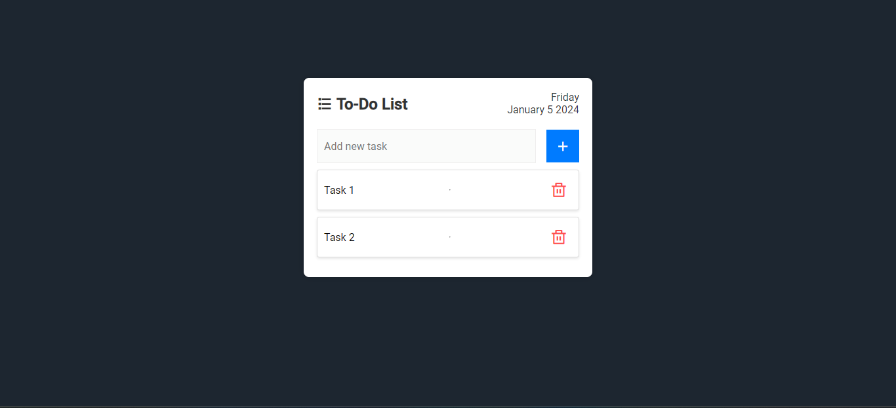

# ToDo List Web App

A simple To-Do List web application built using HTML, CSS, and JavaScript. This application allows users to add, delete, and view tasks, with the added feature of displaying the current date. All tasks are stored locally using the browser's `localStorage`.

## Web Image

## Features

- **Add Task**: Users can add new tasks to the list by entering text in the input field and clicking the "Add" button.

- **Delete Task**: Each task in the list has a delete button, allowing users to remove unwanted tasks.

- **Date and Time Display**: The application displays the current day, month, date, and year.

- **Local Storage**: All tasks are stored locally in the browser's `localStorage`.